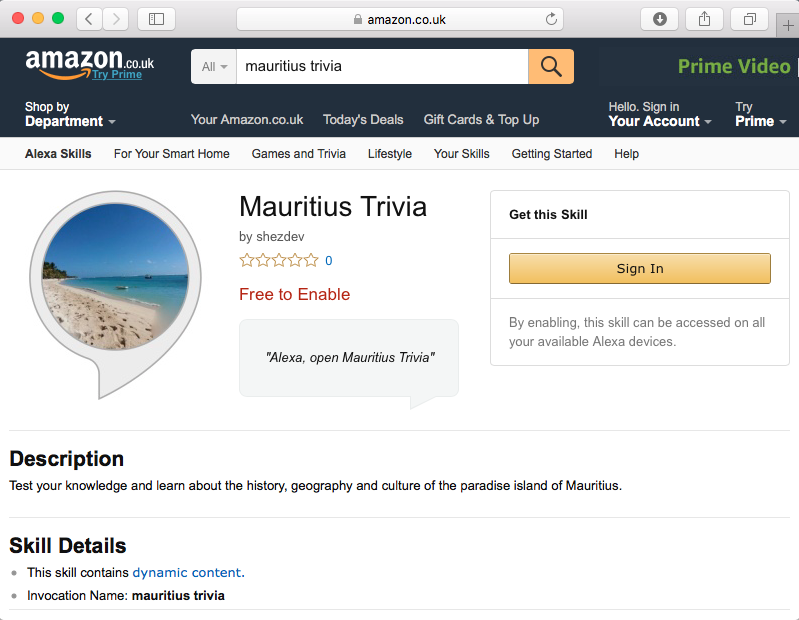

# Mauritius Trivia - Amazon Alexa Skill
Use Alexa to test your knowledge and learn about the history, geography and culture of the paradise island of Mauritius.

## Find and install it here:
https://www.amazon.co.uk/shezdev-Mauritius-Trivia/dp/B071V85B6J/ref=sr_1_1?ie=UTF8&qid=1493723333&sr=8-1&keywords=mauritius+trivia

## To invoke this skill:
"Alexa, open Mauritius Trivia"

## To play:
Alexa will ask you a question and will give you four possible answers, labelled 1-4. select your answer by stating the relevant number!

## Based on:
https://github.com/alexa/skill-sample-nodejs-trivia

## Built using:

* [JavaScript/Node.js](https://docs.npmjs.com/getting-started/installing-node)
* [AWS Lambda](https://aws.amazon.com/lambda/)
* [Alexa Skills Kit (ASK)](https://developer.amazon.com/public/solutions/alexa/alexa-skills-kit)
* [ASK SDK](https://developer.amazon.com/public/community/post/Tx213D2XQIYH864/Announcing-the-Alexa-Skills-Kit-for-Node-js)

## Other useful developer Resources

* [Alexa Developer Forums](https://forums.developer.amazon.com/spaces/165/index.html)
* [Knowledge Base](https://goto.webcasts.com/starthere.jsp?ei=1090197)
* [Intro to Alexa Skills Kit  - On Demand Webinar](https://goto.webcasts.com/starthere.jsp?ei=1090197)
* [Voice Design 101 - On Demand Webinar](https://goto.webcasts.com/starthere.jsp?ei=1087594)
* [Developer Office Hours](https://attendee.gotowebinar.com/rt/8389200425172113931)
* [Developing Skills in Multiple Languages](https://developer.amazon.com/public/solutions/alexa/alexa-skills-kit/docs/developing-skills-in-multiple-languages)
